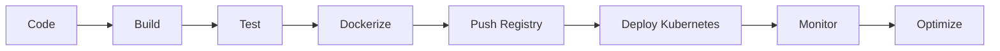

 Maharshi Patel

### DevOps Engineer | Cloud Architect | Automation Specialist

<p align="center">


</p>

<p align="center">
  
  
</p>

---

# 🧠 Engineer Profile

```yaml
name: Maharshi Patel
role: DevOps Engineer
focus: Cloud | Automation | Kubernetes | DevSecOps
philosophy: "Automate. Optimize. Secure. Scale."
```

---

# 🎮 Contribution Graph 

<p align="center">
  
</p>

> Your commits = Snake eating contributions 🔥
> (Auto-updates with your GitHub activity)

---

# ⚡ DevOps Architecture Mindset

<p align="center">
  
</p>

* Infrastructure as Code → Terraform
* Container Orchestration → Kubernetes
* CI/CD → Jenkins + GitOps
* Observability → Prometheus + Grafana
* Cloud → AWS / Azure

---

# 🔥 Core Tech Stack

<p align="center">

</p>

---

# 🚀 Production-Level Projects

## 🔹 Two-Tier Application (Docker + AWS)

```diff
+ Flask + MySQL deployed on EC2
+ Containerized architecture
+ Secure networking & scaling-ready
```

---

## 🔹 CI/CD Pipeline (Jenkins + Docker)

```diff
+ Automated build → test → deploy
+ Docker image lifecycle management
+ Reduced manual deployment time
```

---

## 🔹 Kubernetes Observability Stack

```diff
+ Prometheus metrics collection
+ Grafana dashboards
+ Alerting system
```

---

# 📊 Engineering Metrics

<p align="center">
  
</p>

<p align="center">
  
</p>

---

# 🧬 DevOps Lifecycle



---

---

# 🌐 Connect

<p align="chttps://www.linkedin.com/in/maharsshi/">
    
  </a>
  <a href="mailto:111maharshi@gmail.com">
    
  </a>
</p>

---

# ⚡ DevOps Philosophy

> Infrastructure should be reproducible.
> Deployments should be predictable.
> Systems should be observable.

---

